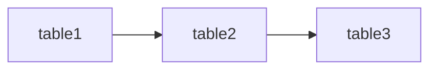

# mini-sqllineage

[](https://pypi.org/project/mini-sqllineage/)
[](https://pypi.org/project/mini-sqllineage/)
[](https://github.com/yourusername/mini-sqllineage/blob/main/LICENSE)
[](https://github.com/yourusername/mini-sqllineage/actions)

A lightweight Python library for analyzing SQL lineage and tracking table dependencies in data pipelines.

## Features

- 📊 **SQL Lineage Analysis**: Parse SQL statements and extract table dependencies
- 🔄 **DAG Visualization**: Visualize data lineage as Directed Acyclic Graph
- 🔍 **Dependency Search**: Find upstream/downstream tables and related dependencies
- 🎯 **Root/Leaf Detection**: Identify source tables (ODS) and target tables (ADS)
- 🖥️ **CLI Tool**: Command-line interface for quick analysis
- 🌐 **Web Visualization**: Interactive web UI for exploring lineage
- ⚡ **Fast**: Token-based parsing, lightweight and efficient

## Installation

```bash
pip install mini-sqllineage
```

## Quick Start

### Python API

```python
from sqllineage import (
    get_all_tables,
    get_all_root_tables,
    search_related_upstream_tables,
)

# Get all tables from SQL
sql = """
INSERT INTO dwd.user_dim SELECT * FROM ods.user;
INSERT INTO ads.user_report SELECT * FROM dwd.user_dim;
"""
tables = get_all_tables(sql)
print(tables)  # ['ods.user', 'dwd.user_dim', 'ads.user_report']

# Get root tables (no upstream dependencies)
root_tables = get_all_root_tables(sql)
print(root_tables)  # ['ods.user']

# Search upstream dependencies
upstream = search_related_upstream_tables(sql, 'ads.user_report')
print(upstream[0])  # ['dwd.user_dim', 'ods.user']
```

### CLI Usage

```bash
# List all tables
sqlh list --all -p /path/to/sql/files

# List root tables
sqlh list --root -p /path/to/sql/files

# Search upstream tables
sqlh search --upstream -t ads.user_report -p /path/to/sql/files

# Open web visualization
sqlh web -p /path/to/sql/files
```

## API Reference

### Core Functions

| Function | Description |
|----------|-------------|
| `get_all_tables(sql)` | Get all tables from SQL statements |
| `get_all_root_tables(sql)` | Get tables with no upstream dependencies |
| `get_all_leaf_tables(sql)` | Get tables with no downstream dependencies |
| `search_related_tables(sql, table)` | Search all related tables (upstream + downstream) |
| `search_related_upstream_tables(sql, table)` | Search upstream dependencies |
| `search_related_downstream_tables(sql, table)` | Search downstream dependents |
| `search_related_root_tables(sql, table)` | Search root tables in the dependency path |
| `read_sql_from_directory(path)` | Read SQL files from directory |

### DagGraph Class

```python
from sqllineage import DagGraph

dag = DagGraph()
dag.add_edge("table_a", "table_b")
dag.add_edge("table_b", "table_c")

# Export to Mermaid
mermaid_str = dag.to_mermaid()

# Export to HTML
html_content = dag.to_html()

# Find upstream/downstream
upstream = dag.find_upstream("table_c")
downstream = dag.find_downstream("table_a")
```

## CLI Commands

### List Tables

```bash
# Get all tables
sqlh list --all -p /path/to/sql/files

# Get root tables
sqlh list --root -p /path/to/sql/files

# Get leaf tables
sqlh list --leaf -p /path/to/sql/files

# Output formats
sqlh list --all -p /path/to/sql/files --output-format json
sqlh list --all -p /path/to/sql/files --output-format text
```

### Search Tables

```bash
# Search upstream tables
sqlh search --upstream -t table_name -p /path/to/sql/files

# Search downstream tables
sqlh search --downstream -t table_name -p /path/to/sql/files

# Search all related tables
sqlh search --all -t table_name -p /path/to/sql/files

# Search root tables
sqlh search --root -t table_name -p /path/to/sql/files
```

### Web Visualization

```bash
# Open web server
sqlh web -p /path/to/sql/files

# Specify HTML output path
sqlh web -p /path/to/sql/files --html-path ./custom.html
```

## Output Formats

### JSON Format

```json
{
    "status": "ok",
    "command": "list-tables",
    "tables": ["table1", "table2"],
    "meta": {
        "table_count": 2
    }
}
```

### Text Format

```
table1
table2
```

### Mermaid Format



## Supported SQL Statements

- `SELECT` queries
- `INSERT INTO ... SELECT` statements
- `CREATE TABLE AS SELECT` (CTAS)
- `WITH ... AS` (CTE)
- `JOIN` operations
- Subqueries

## Development

### Setup

```bash
# Clone the repository
git clone https://github.com/yourusername/mini-sqllineage.git
cd mini-sqllineage

# Install in development mode
pip install -e ".[dev]"

# Run tests
pytest

# Run linting
ruff check .

# Run type checking
mypy sqllineage
```

### Project Structure

```
mini-sqllineage/
├── sqllineage/
│   ├── __init__.py
│   ├── cli.py              # Command-line interface
│   ├── utils.py            # Utility functions
│   └── core/
│       ├── graph.py         # DAG implementation
│       ├── helper.py       # SQL parser
│       └── keywords.py     # SQL keywords
├── tests/                  # Test suite
├── static/                 # Web visualization templates
└── README.md
```

## Contributing

Contributions are welcome! Please feel free to submit a Pull Request.

## License

This project is licensed under the MIT License - see the [LICENSE](LICENSE) file for details.

## Changelog

See [CHANGELOG.md](CHANGELOG.md) for a list of changes.

## TODO

- [ ] Fuzzy search for table names with suggestions
- [ ] Support for more SQL dialects (PostgreSQL, MySQL, etc.)
- [ ] Database schema import (DESCRIBE TABLE)
- [ ] Column-level lineage tracking
- [ ] CI/CD pipeline configuration

## Acknowledgments

- [Cytoscape.js](https://js.cytoscape.org/) - Graph visualization library
- [dagre.js](https://github.com/dagrejs/dagre) - Graph layout algorithm
- [Mermaid.js](https://mermaid.js.org/) - Diagram generation

---

# TODO
- [] 搜索指定表时考虑模糊匹配，当表名不存在时，返回提示或者给出可能的表名（相似度）

## CLI

### output 格式:
- json: 默认格式, 输出 json 格式

1. 搜索命令的输出
```json
{
    "status": "ok",
    "command": "search-table",
    "data": {
        "nodes": [
            {"id": "table1", "label": "ods"},
            {"id": "table2", "label": "dwd"},
        ],
        "edges": [
            {"source": "table1", "target": "table2"}
        ]
    },
    "mermaid": "graph LR\n table1 --> table2",
    "meta": {
        "node_count": 2
    }
}
```


2. 列举命令的输出
```json
{
    "status": "ok",
    "command": "list-tables",
    "tables": [
        "table1",
        "table2"
    ],
    "meta": {
        "table_count": 2
    }
}

```

### CLI 参数
```bash
# 获取所有表名
sqlh list --all --path </path/to/sql-files> --output-format <json|text>

# 获取所有 root 表名
sqlh list --root --path </path/to/sql-files> --output-format <json|text>

# 获取所有 leaf 表名
sqlh list --leaf --path </path/to/sql-files> --output-format <json|text>

# 搜索指定表的root 表名
sqlh search --root --path </path/to/sql-files> --table <table-name> --output-format <json|text>

# 搜索指定表的所有上游表名
sqlh search --upstream --path </path/to/sql-files> --table <table-name> --output-format <json|web|text>

# 搜索指定表的所有下游表名
sqlh search --downstream --path </path/to/sql-files> --table <table-name> --output-format <json|web|text>


# 搜索指定表的所有相关表
sqlh search --all --path </path/to/sql-files> --table <table-name> --output-format <json|web|text>

# 打开全部血缘关系图 web
sqlh web --path </path/to/sql-files>
```